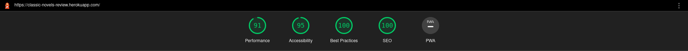
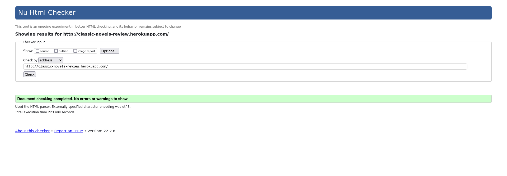
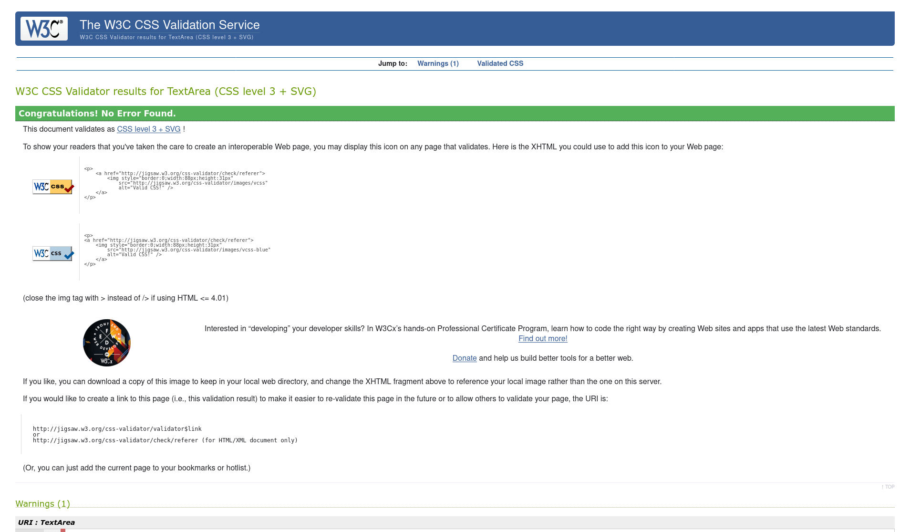

# Classic Novels Review
This website called Classic Novels Review is a website for book enthusiasts that provides a way for them to leave public reviews on book they have read and read reviews others have written. The name Classic Novels Review clearly states what the site is about. It is specifically geared towards classic novels that are know to many.
The purpose of this website is to create a platform for book lovers where they can both contribute to the wider community by leaving reviews and learn about potential books to read by reading reviews others have left.

## Showcase
You can view the Classic Novels Review website [here](https://classic-novels-review.herokuapp.com/).

## UX

### User Stories
My goal was to create a website with a vibe that is appealing to the reader and with an intuitive design that presents the book reviews, the sign up and log in forms, and the profile functionality in a clear manner.
My second goal was to create a website that is available wherever the user is and that works smoothly in all devices, so that they can read the reviews they and others have left wherever they want.

#### First Time User Goals
- As a first time user I want to be able to easily understand what services you provide.
- As a first time user I want to be able to easily be able to read reviews others have left.
- As a first time user I want to be able to easily understand what the membership is about.
- As a first time user I want to know the site easily accessible on computer and mobile devices, especially if I'm going to sign up.

#### Returning User Goals
- As an account holder I want to be able to leave reviews.
- As an account holder I want to be able to see the reviews I have left.
- As an account holder I want to be able to edit and/or delete reviews I have left.
- As an account holder I want to know your website is reliable on all devices I might use.

### Wireframes
For this project I made wireframes for five webpages within the website, namely

- The Home Page
- A page to view a single book in a large mode.
- A register page
- A login page
- And the profile  page

Each of the pages has three wireframes

- One for small screens
- One for medium screens
- One for large screens

During the development process the focus of the project shifted from the books themselves to focus more on the reviews. The main differences between the wireframes and the live site is that I left out the page to view a single book and that the site lists reviews rather than books. The main reason for this was that I had to lessen the scope of the project to meet the deadline.
The home page lists all reviews on the website while the account focuses on leaving reviews on the desired book.
The signup and login pages basically just contain simple forms for a clean design. 
Finally the profile page shows the reviews the user has left.

The wireframes were created using - [InVision](https://www.invisionapp.com/). 

You can view the wireframes [here](https://dennischmielewski323696.invisionapp.com/freehand/Classic-Novels-Review-EoIn0vC2r).

NOTE: The link to view the wireframes is not supported on the Firefox desktop browser but it works fine on mobile. It works fine on Chrome and Opera as well.

### Structure
The structure of the website is laid out in such a way that the reviews have the main focus. Only a navbar at the top for navigation through the website, a hero image along with welcome text and a footer is present otherwise.
The home page displays all reviews a stated above and if you create an account you get access to leaving reviews as well as editing and/or deleting reviews you have left. A non-member can only view the list of reviews without being able to interact with them. 

As for structuring the database there are three data collections or tables created. One for users, one for reviews and one for books. From the start I set out to use descriptions for the books on the website but as I progressed in the development process I had do lessen the scope along the way. This led to the descriptions being in the database but they were left unused wich led to incongruency in the data model.
I decided to scratch the descriptions and only used 'title' and 'author' fields in the book table. They are fetched and displayed in the reviews whenever a user creates a review, alongside the username and the user inputs 'review title' & 'review description̈́'.
Whenever a user creates a review it is posted to the database with the user forms inputs of username (or 'added by'), review title, review decsription and 'book id' which contains both the authors name and the book title.
A new user entry is posted to the 'users' table in the database with the fields 'username' and 'password' whenever a user decides to create an account. The username is stored securely within the database using SHA ecryption.

### Design
To create an appealing feel to the website, I chose a mellow theme with green and white colors with not much extra going on around the reviews themselves to keep the main focus on them rather anything else. The green theme with the brown in the hero image I think creates a cozy feeling which makes me want to read. This is what I myself would want in such a website. For this reason I also chose to just have the name 'Classic Novels Review' as the logo.
To make the website responsive I decided to go with Boostrap5 since it is an easy framework to work with that I have prior experience with. As a detail I added smooth scrolling behavior to the website to make the user experience more pleasant and seamless.

During the development process I enhanced the design for better UX by 

- Simplifying the text on the button in the edit review form from 'Edit Review!' to 'Edit'.
- Similarly, removing the exclamation mark from the login and signup button as well.
- Updating the edit buttons color to blue, the cancel/delete buttons color to red, and the add/logn/signup buttons to green.
- Removing the 'Done button from the added reviews as it turned out to be redundant.
- Improving the navbar styling hover effect from having a black underscore to simply the same slight gray as is used in the footer icons, for consistency.

There is potential for further styling, especially in regards to the Bootstrap accordion. However given the time crunch I decided not to go with it at this time as the accordion is functional and serves its purpose with displaying the reviews.

## Features
- Responsive Design across all device sizes, including a hamburger menu button on smaller screens.
- Functionality to read the reviews others have left.
- Functionality for users to create an account.
- Functionality to add, edit and delete reviews within the account.

#### Features Left to Implement
Some features were not able to be implemented on this current release.
The following is a list of features that will be implemented on a future release:

- Emails sent to user for for resetting passwords.
- Function to delete an account.
- Adding images to all books that are available for review.
- Adding descriptions of for all books available for review.
- Showing a single book and it's reviews detail.
- Ability to add additional books for reviewing.

## Technologies
The technologies used to build this website are the following

#### Development
- [Gitpod Online IDE](https://www.gitpod.io/) for all code editing.
- [Firefox Developer Tools](https://developer.mozilla.org/en-US/docs/Tools) for all functional testing throughout the development process.

#### Testing
- [Lighthouse](https://developers.google.com/web/tools/lighthouse/) for performance testing of the website.
- [The W3C Markup Validator](https://validator.w3.org/) for testing of all HTML code.
- [The W3C CSS Validator](https://jigsaw.w3.org/css-validator/) for testing of all CSS code.

#### Images
- [Unsplash](https://unsplash.com/) for the image used on the website.
- [TinyPNG](https://tinypng.com/) for compressing project images.

#### Fonts & Icons
- [Google Fonts](https://fonts.google.com/share?selection.family=Noto%20Sans%20KR%7COpen%20Sans) for the fonstyles 'Noto Sans KR' and 'Open Sans' used on the website. 
- [Font Awesome](https://fontawesome.com/start) for all website icons.

### Languages 
- [HTML5](https://en.wikipedia.org/wiki/HTML5) was utilized for laying the foundation and structuring the basis of the website content. 
- [CSS3](https://en.wikipedia.org/wiki/CSS#CSS_3) was utilized for the placement and styling of all HTML5 content on the website. 
- [JavaScript](https://en.wikipedia.org/wiki/JavaScript) was utilized for creating animations on the website as well as creating interactivity with, and generating real-time information for the user.
- [Python3](https://www.python.org/downloads/) for handling user accounts and passing data to and from the database.

### Frameworks
- [Bootstrap v5.0](https://getbootstrap.com/docs/5.0/getting-started/introduction/) Bootstrap 5 was used to implement a responsive mobile-first design on the website.
- [Flask](https://palletsprojects.com/p/flask/) to create templates used throughout the website.

### Databases
- [MongoDB](https://www.mongodb.com/) for handling and storing user data when interacting with their account. Three data collections were created in total - one for books, one for reviews and one for users.

## Testing
At first the site did not work properly. The CRUD operations for faulty, the login fucntionality was not working properly and the data model was incongruent.
Now the CRUD functionality is working as excpected. The login functionality is also working properly.
The data model has been modified alongside updating the functions to create a congruent data model where both operations to get data from the database posting data to the database makes sense. All user inputs are posted to the database correctly and all book data is retrieved from the database correctly.

### The following user stories were tested for as a first time user

 - As a first time user I want to be able to easily understand what services you provide.
 By visiting the homepage the welcome text, hero image and posted reviews make it clear what the service is about. The information is presented clearly on computers, tablets and mobile.

 - As a first time user I want to be able to easily be able to read reviews others have left.
 All reviews are clearly visible and dislayed correctly on mobile, tablets and computer when tested for. The visibilty could be improved by making the width a bit less on mobile as well as implementing some margins between reviews.

 - As a first time user I want to be able to easily understand what the membership is about.
 The home page welcome text and all reviews clearly visible on mobile, tablets and computer when tested for.  

 - As a first time user I want to know the site easily accessible on computer and mobile devices, especially if I'm going to sign up.
 The website is displayed correctly on mobile, tablets and computer when tested for. There is some side-scrolling present which I notice more on mobile than larger devices. The site works properly but there is room for UX improvement in this regard.

### The following user stories were tested for as an account holder

 - As an account holder I want to be able to leave reviews.
 Reviews can be left properly and all form inputs and buttons work properly computer, tablets and mobile devices when tested for.

 - As an account holder I want to be able to see the reviews I have left.
 The reviews I have left a clearly marked with the options to edit and delete on computer, tablets and on mobile when tested for.

 - As an account holder I want to be able to edit and/or delete reviews I have left.
 The functionality to edit and delete reviews is present and works properly on computer, tablets and on mobile when tested for.

 - As an account holder I want to know your website is reliable on all devices I might use.
 The proper functionality and relevant layout is present on computer, tablets and mobile when tested for. There is some side-scrolling present which I notice more on mobile than larger devices. The site works properly but there is room for UX improvement in this way.

#### The testing procedures where performed on the following devices and operating systems

- Manually tested for user stories on Android on a Motorola g20.  
- Manually tested for user stories on Linux Mint on a Dell XPS 15 Laptop.
- Manually tested for user stories on Windows 10 on a Dell XPS 15 Laptop.

- Tested on Samsung Galaxy Note 20, Samsung Galaxy S10 and Samsung Galaxy S20 using Firefox Developer Tools.
- Tested on Iphone 11, 12 and 13 using Firefox Developer Tools.
- Test on Ipad and Kindle Fire HDX Tablets using Firefox Developer Tools.

Results from Lighthouse performance test

The Lighthouse report first came back with 75-85% on performance and accessibility. I then compressed the images a few more times and resolved the html validator issues I had before. These two measures particularly improved the performance and accessibility of the site to yield a higher score. The relatively lower rating on the performance is due to a combination of Bootstrap, Fontawesome and the hero image. I compressed the hero image until I could not compress it any further, using Tiny PNG. After a certain point the image would not compress significantly more. Bootstrap and Fontawesome are necessary for this project so I left it as is. Given these things I feel it is an acceptable result with relatively high performance result.

Results from W3C Markup Validator test

 My first validator report came back with quite a few errors and warnings the first time. These erros pertained to the 'add' and 'edit' review buttons in the review forms, a couple of semantic tags that were out of place and the Bootstrap accordions which wrongly contained a couple of 'id' attributes.
 After fixing the structure of the 'add' and 'edit' review buttons, removing the missplaced semantic tags and 'id' attributes in the Bootstrap accordions The Markup Validator came back with no errors the second time.

Results from W3C CSS Validator test

The CSS Validator came back with no issues at all.

#### Bugs Fixed
- Reversed the structure to make the reviews the main function, rather than the books which I had done from the beginning.
- Broken showcase link in README.md is now working properly.
- The 'Cancel'-buttons on the 'Add' and 'Edit' review forms wrongly posted new reviews. This was fixed by changing the type attributes from 'submit' to 'reset'. 
- The book title and author name is displayed in added reviews in the 'reviews' template. This was done by getting the book object from the db rather than just the book name which I did at first.
- The login and signup functionality is now working properly.
- The complete CRUD functionality is now working properly with the ability for all users to read reviews, and the ability for registered users to add new reviews and edit and/or delete existing reviews.
- Unexpected Bootstrap5 accordion behavior was fixed by leaving out the accordion header and just keeping the accordion body.
- The review data and the book title was not pre-loading into the form when editing a review. This was fixed by updating the 'edit review'-function and 'edit review'-template.

#### Bugs Left
- Book title and author name is not showing in the 'profile' template along with review title, description and the username, while it is showing in the 'reviews' template.S
- All reviews are displaying in the profile page rather than only user specific reviews.
- The site is scrolling a bit sideways both on desktop and on mobile.

## Deployment
The deployment of this project was accomplished using Gitpod and Git for version control. 
I used Gitpod to write all code and push all changes made to my Github Repository using Git from the Gitpod terminal.

### Repository
If you want to view this website locally on your computer:
- Click on your preferred clone method in the upper right-hand side corner of this repository.
- Open your cloned repository in your IDE of choice.
- Run the website on a local server from there.

This project reposity is hosted on  
- [GitHub](https://github.com/) - you can find it at [this link](https://github.com/tetrapak-dev/milestone-project-3)

### Hosting Platform
This website is hosted on [Heroku](https://www.heroku.com/home) and is deployed directly from the 'master' branch. The deployed website will update automatically when new changes are committed to the master branch. 

To host this website:
- I created a requirements.txt file using the terminal command 'pip freeze > requirements.txt'.
- Then created a Procfile with the terminal command 'echo web: python app.py > Procfile'.
- I added, committed, and pushed the files to the projects Github repository.
- After that I created a new app on the Heroku website by clicking the "New" button in the dashboard.
- From within the new app I clicked on settings --> deploy --> deployment method and then selected Github to connec the app to my Github repository.
- Lastly I added the necessary config vars for 'IP', 'dabase name', 'database URI', 'port', 'secret_key' and 'key' in order to make the app able to run.

The website can be viewed [here](https://classic-novels-review.herokuapp.com/)

## Credits
The following book titles were used for this projects

- [The Grapes of Wrath](https://www.penguin.co.uk/books/26143/the-grapes-of-wrath/9780141185064.html)

- [The Adventures of Huckleberry Finn](https://www.penguin.co.uk/books/276485/the-adventures-of-huckleberry-finn/9780143107323.html)

- [1984](https://www.penguin.co.uk/books/1084996/nineteen-eighty-four/9781787302549.html)

- [Frankenstein](https://www.penguin.co.uk/books/183673/frankenstein/9780141198965.html)

- [Moby-Dick](https://www.penguin.co.uk/books/62240/moby-dick/9780142437247.html)

- [Jane Eyre](https://www.penguin.co.uk/books/1060371/jane-eyre/9780241438695.html)

- [The Call of the Wild](https://www.penguin.co.uk/books/59518/the-call-of-the-wild/9780141321059.html)

- [Crime and Punishment](https://www.penguin.co.uk/books/35469/crime-and-punishment/9780140449136.html)

- [Brave New World](https://www.penguin.co.uk/books/34231/jane-eyre/9780141040387.html)

- [Pride and Prejudice](https://www.penguin.co.uk/books/1050871/pride-and-prejudice/9781857150018.html)

### Acknowledgements
- My mentor [Akshat Garg](https://github.com/akshatnitd) for his very much appreciated and needed advice and support.
- Code Institute's tutor Tim Nelson's video lessons on creating a backend project.
- [Code Institute](https://codeinstitute.net/)'s Student Care and Slack community.

#### This project was made as part of Code Institute's Full Stack Software Development Programme. 
#### This is for educational purposes only.
#### Created by Dennis Chmielewski.
 